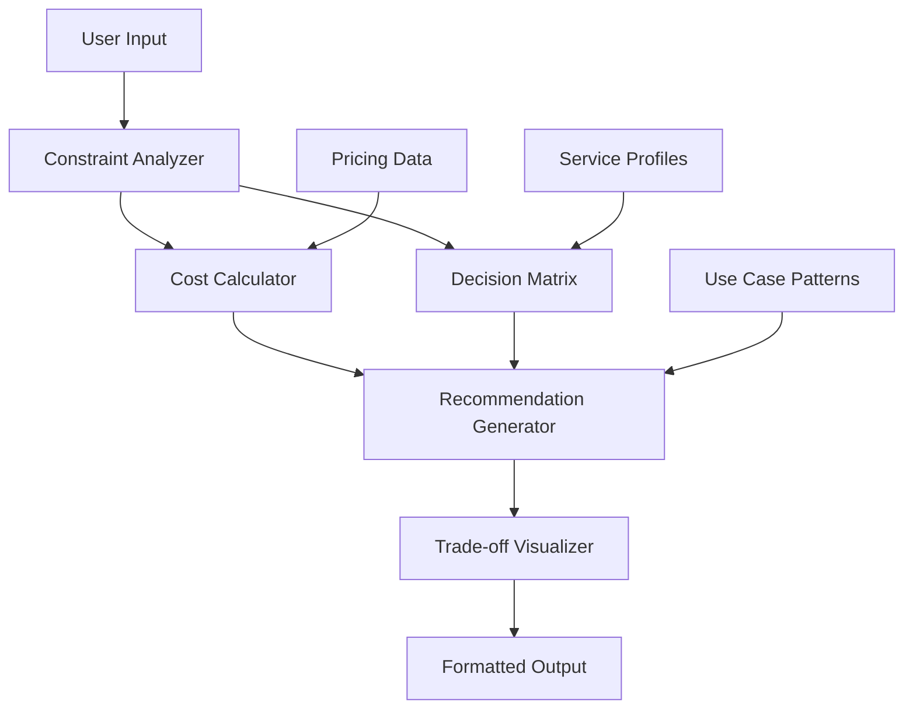

# Design Document: Enhanced Trade-off Logic

## Overview

The enhanced trade-off logic will transform the Cloud Referee from a basic constraint-based comparison tool into a sophisticated decision support system. The current implementation uses simple if-else logic with four basic constraints. The enhanced version will implement a multi-dimensional scoring system, dynamic cost analysis, and contextual recommendations that provide more accurate and nuanced trade-off analysis.

## Architecture

The enhanced system follows a modular architecture with clear separation of concerns:



### Core Components

1. **Constraint Analyzer**: Processes and validates user inputs, handles constraint conflicts
2. **Cost Calculator**: Performs dynamic cost analysis based on usage patterns
3. **Decision Matrix**: Multi-dimensional scoring system with weighted criteria
4. **Recommendation Generator**: Contextual logic that produces conditional recommendations
5. **Trade-off Visualizer**: Enhanced output formatting with clear trade-off presentation

## Components and Interfaces

### Constraint Analyzer

```python
class ConstraintAnalyzer:
    def analyze_constraints(self, raw_constraints: dict) -> AnalyzedConstraints:
        """Process and validate user constraints"""
        
    def detect_conflicts(self, constraints: AnalyzedConstraints) -> List[ConflictWarning]:
        """Identify conflicting constraint combinations"""
        
    def suggest_clarifications(self, constraints: AnalyzedConstraints) -> List[str]:
        """Suggest additional questions for ambiguous constraints"""
```

### Cost Calculator

```python
class CostCalculator:
    def estimate_costs(self, service: str, usage_pattern: UsagePattern) -> CostEstimate:
        """Calculate estimated monthly costs for a service"""
        
    def compare_costs(self, estimates: List[CostEstimate]) -> CostComparison:
        """Compare cost structures and identify break-even points"""
        
    def get_pricing_assumptions(self) -> List[str]:
        """Return current pricing assumptions and caveats"""
```

### Decision Matrix

```python
class DecisionMatrix:
    def score_service(self, service: str, constraints: AnalyzedConstraints) -> ServiceScore:
        """Score a service across all evaluation dimensions"""
        
    def apply_weights(self, scores: List[ServiceScore], weights: dict) -> List[WeightedScore]:
        """Apply user-specified weights to dimension scores"""
        
    def normalize_scores(self, scores: List[WeightedScore]) -> List[NormalizedScore]:
        """Normalize scores for fair comparison"""
```

### Recommendation Generator

```python
class RecommendationGenerator:
    def generate_recommendations(self, scores: List[NormalizedScore], 
                               costs: CostComparison) -> RecommendationSet:
        """Generate contextual recommendations based on analysis"""
        
    def create_conditional_logic(self, analysis: ComparisonAnalysis) -> ConditionalRecommendations:
        """Create if-then recommendation logic"""
        
    def identify_edge_cases(self, constraints: AnalyzedConstraints) -> List[EdgeCaseWarning]:
        """Flag potential risks or special considerations"""
```

## Data Models

### Enhanced Constraint Model

```python
@dataclass
class AnalyzedConstraints:
    budget: BudgetConstraint
    data_privacy: PrivacyConstraint
    scalability: ScalabilityConstraint
    vendor_lockin_tolerance: VendorLockInConstraint
    usage_pattern: UsagePattern
    technical_requirements: TechnicalRequirements
    existing_infrastructure: InfrastructureContext
    use_case_type: UseCaseType
    
@dataclass
class UsagePattern:
    requests_per_day: int
    average_tokens_per_request: int
    peak_usage_multiplier: float
    geographic_distribution: List[str]
    
@dataclass
class TechnicalRequirements:
    max_latency_ms: int
    required_models: List[str]
    integration_complexity_tolerance: str
    uptime_requirements: float
```

### Service Profile Model

```python
@dataclass
class ServiceProfile:
    name: str
    capabilities: ServiceCapabilities
    pricing_model: PricingModel
    integration_characteristics: IntegrationProfile
    performance_characteristics: PerformanceProfile
    
@dataclass
class ServiceCapabilities:
    available_models: List[str]
    data_privacy_level: str
    scalability_ceiling: str
    geographic_availability: List[str]
    enterprise_features: List[str]
```

### Scoring Model

```python
@dataclass
class ServiceScore:
    service_name: str
    dimension_scores: Dict[str, float]  # 0-1 scale
    confidence_levels: Dict[str, float]  # 0-1 scale
    supporting_evidence: Dict[str, List[str]]
    
@dataclass
class CostEstimate:
    service_name: str
    monthly_cost_range: Tuple[float, float]
    cost_components: Dict[str, float]
    scaling_characteristics: str
    assumptions: List[str]
```

## Correctness Properties

*A property is a characteristic or behavior that should hold true across all valid executions of a system-essentially, a formal statement about what the system should do. Properties serve as the bridge between human-readable specifications and machine-verifiable correctness guarantees.*

### Property Reflection

After analyzing all acceptance criteria, I identified several areas where properties can be consolidated:

- Properties 1.1 and 2.1 both test usage pattern integration - can be combined into a comprehensive usage pattern property
- Properties 3.1, 3.4 test scoring completeness - can be combined into one comprehensive scoring property  
- Properties 5.3, 5.4, 5.5 all test output organization - can be combined into one output structure property
- Properties 6.3, 6.4, 6.5 all test uncertainty/caveat handling - can be combined into one uncertainty handling property

### Converting EARS to Properties

Based on the prework analysis, here are the key correctness properties:

**Property 1: Usage Pattern Integration**
*For any* valid usage pattern and service combination, when usage patterns are provided to the Constraint_Analyzer, the resulting cost calculations should reflect those specific usage characteristics
**Validates: Requirements 1.1, 2.1**

**Property 2: Technical Requirements Influence Scoring**
*For any* set of technical requirements, services that better match those requirements should receive higher compatibility scores than services that match them poorly
**Validates: Requirements 1.2**

**Property 3: Infrastructure Context Affects Integration Scoring**
*For any* existing infrastructure context, services with better integration compatibility should receive lower integration complexity scores
**Validates: Requirements 1.3**

**Property 4: Constraint Conflict Detection**
*For any* set of conflicting constraints, the Constraint_Analyzer should detect the conflicts and provide explanations for the trade-offs
**Validates: Requirements 1.4**

**Property 5: Ambiguous Input Handling**
*For any* ambiguous constraint input, the system should either request clarification or apply reasonable defaults with clear documentation
**Validates: Requirements 1.5**

**Property 6: Comprehensive Cost Estimation**
*For any* usage pattern, cost estimates should include all relevant pricing components and be generated for all supported services
**Validates: Requirements 2.2, 2.1**

**Property 7: Break-even Analysis**
*For any* cost comparison between services, when usage patterns vary significantly, break-even points and scaling patterns should be identified and highlighted
**Validates: Requirements 2.3**

**Property 8: Pricing Model Explanation**
*For any* comparison involving services with different pricing models, the implications of each pricing approach should be clearly explained
**Validates: Requirements 2.4**

**Property 9: Cost Uncertainty Handling**
*For any* cost projection with uncertain inputs, ranges and confidence levels should be provided rather than single point estimates
**Validates: Requirements 2.5**

**Property 10: Comprehensive Scoring**
*For any* service evaluation, scores should be generated across all defined constraint dimensions and include both individual dimension scores and overall ratings
**Validates: Requirements 3.1, 3.4**

**Property 11: Weight Application**
*For any* user-specified weights, the Decision_Matrix should apply these weights consistently across all services and dimensions
**Validates: Requirements 3.2**

**Property 12: Score Normalization**
*For any* set of raw dimension scores, the normalization process should produce comparable scores that enable fair comparison between services
**Validates: Requirements 3.3**

**Property 13: Close Score Uncertainty Detection**
*For any* comparison where service scores are within a small threshold, the system should flag the uncertainty and highlight key differentiating factors
**Validates: Requirements 3.5**

**Property 14: Use Case Contextual Recommendations**
*For any* use case pattern, recommendations should vary appropriately based on the specific characteristics and requirements of that use case type
**Validates: Requirements 4.1**

**Property 15: Conditional Recommendation Logic**
*For any* scenario where multiple factors favor different services, the system should provide conditional recommendations with clear decision criteria rather than absolute choices
**Validates: Requirements 4.2**

**Property 16: Recommendation Reasoning**
*For any* generated recommendation, the system should provide clear explanations of the reasoning and factors that led to that recommendation
**Validates: Requirements 4.3**

**Property 17: Edge Case Detection**
*For any* input combination that represents an edge case or unusual scenario, the system should flag potential risks and special considerations
**Validates: Requirements 4.4**

**Property 18: Uncertainty-Based Evaluation Suggestions**
*For any* recommendation with high uncertainty, the system should suggest specific evaluation approaches or pilot strategies to reduce decision risk
**Validates: Requirements 4.5**

**Property 19: Visual Indicator Usage**
*For any* complex trade-off scenario, appropriate visual indicators should be used to highlight key points and improve readability
**Validates: Requirements 5.2**

**Property 20: Output Organization**
*For any* generated output, related points should be grouped together, redundant information should be eliminated, and conditional scenarios should be clearly separated
**Validates: Requirements 5.3, 5.4, 5.5**

**Property 21: Performance Claims Caveats**
*For any* claim about service performance or capabilities, appropriate caveats and disclaimers should be included to prevent overconfidence
**Validates: Requirements 6.3**

**Property 22: Uncertainty and Limitation Flagging**
*For any* information that is uncertain, outdated, or based on assumptions, these limitations should be clearly flagged and documented
**Validates: Requirements 6.4, 6.5**

**Property 23: Service Extensibility**
*For any* new service added to the system, it should integrate without requiring changes to the core comparison logic or breaking existing functionality
**Validates: Requirements 7.1**

**Property 24: Criteria Extensibility**
*For any* new evaluation criterion added to the system, it should integrate seamlessly with existing constraint types and scoring mechanisms
**Validates: Requirements 7.2**

**Property 25: Independent Service Profile Updates**
*For any* service profile update, changes should not affect other services or require system-wide modifications
**Validates: Requirements 7.3**

**Property 26: Backward Compatibility**
*For any* existing constraint input format, the system should continue to process it correctly even after feature additions or updates
**Validates: Requirements 7.4**

**Property 27: Trade-off Philosophy Preservation**
*For any* system enhancement or new feature, the output should continue to provide trade-offs and conditional recommendations rather than absolute answers
**Validates: Requirements 7.5**

## Error Handling

The enhanced system will implement comprehensive error handling:

### Input Validation Errors
- Invalid constraint values → Provide clear error messages with valid options
- Missing required usage patterns → Request specific information needed
- Conflicting constraint combinations → Explain conflicts and suggest resolutions

### Calculation Errors
- Pricing data unavailable → Use cached data with staleness warnings
- Cost estimation failures → Provide qualitative comparisons with uncertainty flags
- Scoring calculation errors → Fall back to simplified scoring with reduced confidence

### Data Quality Issues
- Outdated service information → Flag data age and suggest verification
- Incomplete service profiles → Clearly indicate missing information in comparisons
- Uncertain capability claims → Provide confidence levels and caveats

## Testing Strategy

The testing approach combines unit tests for specific scenarios with property-based tests for comprehensive validation:

### Unit Testing Focus
- Specific constraint combinations and their expected outcomes
- Edge cases like extreme usage patterns or conflicting requirements
- Error conditions and recovery mechanisms
- Integration points between components

### Property-Based Testing Configuration
- **Framework**: Hypothesis (Python) for property-based testing
- **Test Configuration**: Minimum 100 iterations per property test
- **Test Tagging**: Each test references its design document property
- **Tag Format**: **Feature: enhanced-trade-off-logic, Property {number}: {property_text}**

### Dual Testing Benefits
- Unit tests catch concrete bugs and validate specific examples
- Property tests verify universal correctness across all input combinations
- Together they provide comprehensive coverage of both expected and edge cases
- Property tests help discover unexpected input combinations that break assumptions

### Test Data Strategy
- Generate realistic constraint combinations using domain knowledge
- Include edge cases like zero usage, extreme budgets, conflicting priorities
- Test with both current and historical service data to verify robustness
- Validate against known decision scenarios to ensure practical accuracy
