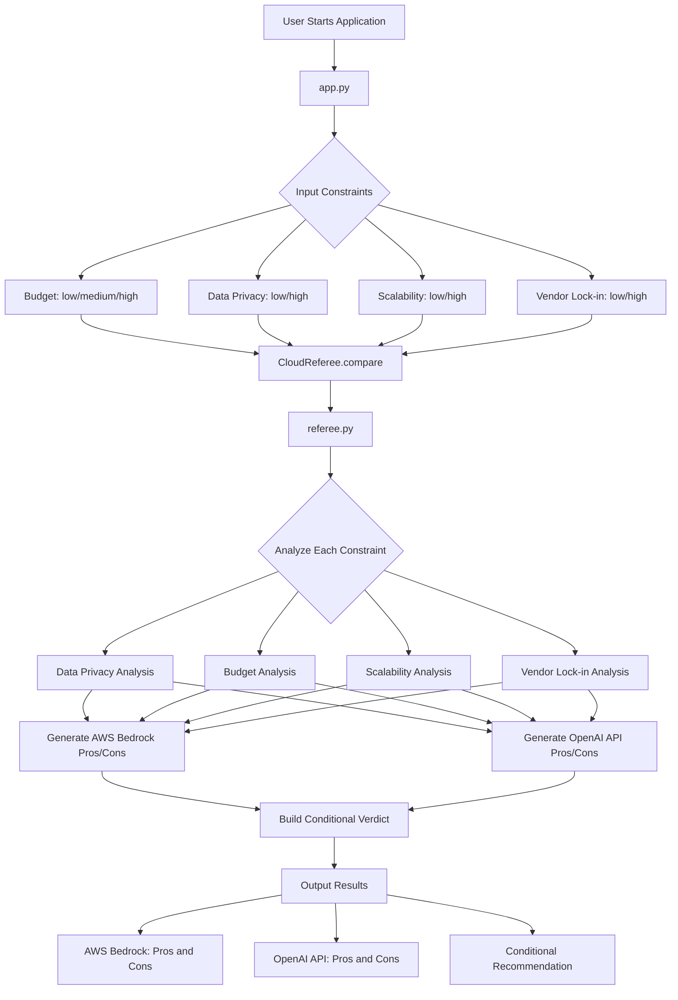
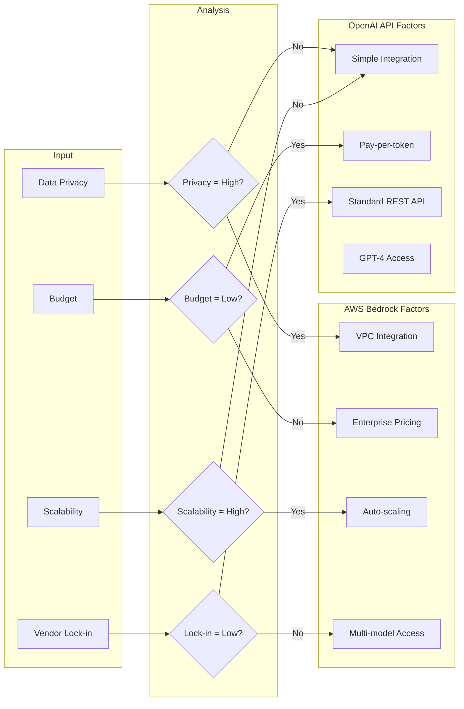
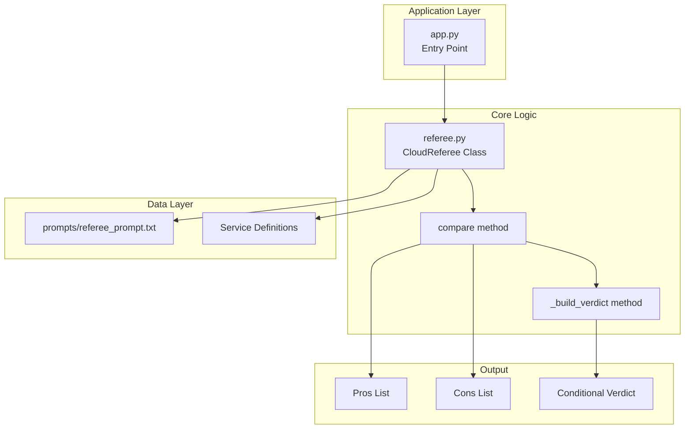

# Cloud Referee

A command-line tool that compares AWS Bedrock and OpenAI API based on user constraints, providing trade-off analysis instead of a single recommendation.

## Problem Statement

Developers frequently face challenges when selecting AI platforms:
- Most recommendations are one-sided without context
- Trade-offs between services are not clearly explained
- Decision criteria vary based on project requirements

## Solution

Cloud Referee takes user-defined constraints and generates a balanced comparison:
- Analyzes both options objectively
- Lists pros and cons for each service
- Provides conditional recommendations based on specific use cases

## Architecture Flowchart



## Decision Logic Flowchart



## Component Diagram



## Features

- Constraint-based comparison (budget, data privacy, scalability, vendor lock-in)
- Structured pros/cons output for both AWS Bedrock and OpenAI API
- Conditional verdict system (no absolute "best" answer)
- CLI interface for quick evaluation

## Project Structure

```
cloud-referee-kiro/
├── app.py                      # Main application entry point
├── referee.py                  # Core comparison logic
├── prompts/
│   └── referee_prompt.txt      # Referee prompt template
├── .kiro/                      # Kiro configuration
└── README.md
```

## Installation

```bash
git clone https://github.com/karthik129259/cloud-referee-kiro.git
cd cloud-referee-kiro
```

## Usage

```bash
python app.py
```

The application will prompt for the following constraints:
- Budget: low / medium / high
- Data Privacy: low / high
- Scalability: low / high
- Vendor Lock-in Tolerance: low / high

## Example Output

```
============================================================
CLOUD REFEREE - AWS Bedrock vs OpenAI API
============================================================

Enter your constraints to get a personalized comparison:

Budget (low/medium/high): medium
Data Privacy requirement (low/high): high
Scalability needs (low/high): high
Vendor lock-in tolerance (low/high): low

============================================================
COMPARISON RESULTS
============================================================

AWS BEDROCK
  Pros:
     - Data stays within AWS infrastructure - better for compliance
     - VPC integration for isolated environments
     - Flexible pricing with multiple model options
     - Seamless scaling with AWS infrastructure
     - Auto-scaling and load balancing built-in
     - Access to multiple AI models (Claude, Llama, Titan, etc.)
     - Native AWS service integration (Lambda, S3, etc.)
  Cons:
     - Tighter AWS ecosystem integration may increase dependency

OPENAI API
  Pros:
     - Transparent token-based pricing
     - Easier to switch - standard REST API
     - Model-agnostic integration possible
     - Access to GPT-4 and latest OpenAI models
     - Extensive documentation and community support
     - Rapid model updates and improvements
  Cons:
     - Data sent to external OpenAI servers
     - Rate limits may require enterprise plan

============================================================
VERDICT (Trade-off Based)
============================================================

Choose AWS BEDROCK if:
   - You need high data privacy and compliance (HIPAA, SOC2)
   - You are already in the AWS ecosystem
   - You need access to multiple AI models (Claude, Llama, Titan)
   - You require enterprise-grade scaling

Choose OPENAI API if:
   - You want fastest access to cutting-edge GPT models
   - You prefer simple setup and integration
   - You are building prototypes or MVPs quickly
   - You want strong community support and resources

Based on your HIGH data privacy requirement:
   AWS Bedrock is strongly recommended
```

## How It Works

1. User inputs constraints via CLI
2. `CloudReferee` class evaluates constraints against service characteristics
3. Pros and cons are dynamically generated based on input
4. Conditional verdict provides context-aware recommendations

## Technical Details

- Language: Python 3
- Dependencies: None (standard library only)
- Architecture: Modular design with separate referee logic

## Comparison Criteria

| Constraint | AWS Bedrock Advantage | OpenAI API Advantage |
|------------|----------------------|---------------------|
| High Data Privacy | Data stays in AWS VPC | - |
| Low Budget | - | Predictable per-token pricing |
| High Scalability | Native AWS auto-scaling | - |
| Low Vendor Lock-in | - | Standard REST API |

## AI for Bharat - Kiro Week 6 Challenge

This project was developed for the Kiro Week 6: The Referee challenge.

Challenge objective: Build a tool that compares options and explains trade-offs, helping users make informed decisions rather than providing single-answer recommendations.

## Development

Built using Kiro for:
- Prompt engineering and refinement
- Code structure generation
- Logic optimization

## License

MIT
